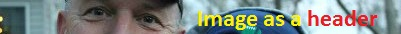

## MMM-ImageHeader

Use an image as a header instead of the standard underlined text header

Create or use any image you want to use as a header.

You can choose your own local images or url's to internet images.

## Examples

, , ,

Use your own custom header pictures!

## Installation

* `git clone https://github.com/mykle1/MMM-ImageHeader` into the `~/MagicMirror/modules` directory.
* 
* Annotated .css file included for exact sizing and positioning.

## Config.js entry and options

    {
        module: "MMM-ImageHeader",
		position: "top_left",
		config: {
			headerImage: 'modules/MMM-ImageHeader/pix/1.jpg', // local path to your image or internet url to image.
		}
	},
	
## How to use it multiple times!

* Copy and paste the entire MMM-ImageHeder folder

* Rename the new folder (Example: MMM-ImageHeader2)

* Open that folder and rename the .js file the same as the folder

* Open the .js file and rename this 'Module.register("MMM-ImageHeader"' the same as the folder

* Also rename this 'return ["MMM-ImageHeader.css"]' the same as the folder (keeping the .css)

* Close the .js file

* Rename the .css file the same as the folder

* Open the .css file

* Rename this `.MMM-ImageHeader .photo` the same as the folder (keeping the .photo)

## The path to your local pictures

* Your pictures go here `modules/MMM-ImageHeader/pix/YOUR_PICTURE_NAME`

## The pictures for multiple use

* They go in their respective `pix` folder

## Attention

* You may have to use custom.css on the modules you are using this with

* Disable the header on the modules you are using this with
